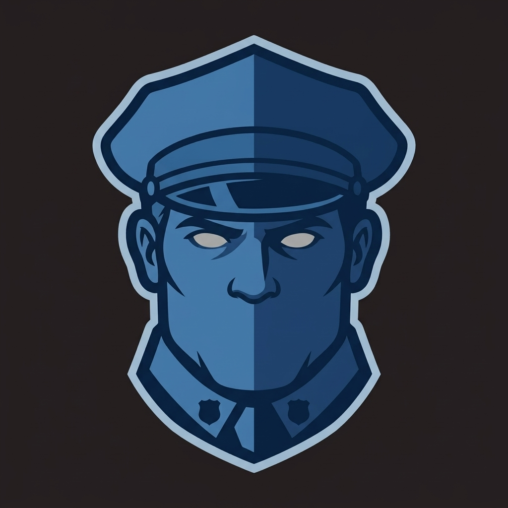

<div align="center">
  <h1>night-watchman</h1>
  
</div>

**the night shift for your Claude Code repo.**

Claude Code plugin: tickets become dispatch contracts, a session starts
itself, cheap models do the reading, the expensive one only decides.

- **tickets an agent can start cold** — frontmatter says what to touch,
  how to verify, who finishes.
- **a session that opens itself** — orient, verify what's pending, fan
  work out in parallel.
- **expensive model decides, cheap model reads** — hooks and briefs keep
  the main thread out of tool output.
- **script beats agent beats skill** — repeated work climbs down the
  ladder to something cheaper than re-deriving it.
- **fewer questions every week** — a capped decision profile the session
  checks before asking you.

This plugin was extracted from a production system that has been
measuring its own operating cost since before this repo existed — the
honest version, caveats included, lives in [docs/evidence.md](docs/evidence.md).

## What this is

An unattended-operations engine, which is a different question rather than a
better answer to an existing one.

A workflow and an agent team both answer **"how do I run N agents right now?"**
night-watchman answers **"what has to be true for work to proceed while nobody
is watching?"** Those are orthogonal, and the second decomposes into four
things:

- **the unit of work** — a ticket is a contract an agent can execute cold: what
  to touch, how to verify, who finishes
- **the economics** — script beats agent beats skill, and hooks keep the
  expensive model out of tool output the cheap one can read
- **the safety envelope** — a deterministic write guard, a capped still-ask
  list, and escalation that marks an assumption and keeps going rather than
  stalling for a human who is not there
- **the record** — decisions, known issues, handoffs and memory, written so the
  next session starts from them instead of re-deriving them

Roughly: a workflow is a `for` loop with a thread pool, an agent team is an org
chart, and this is CI/CD plus runbooks plus the on-call rotation. It defines the
unit, the gates, the record and the cost model, then hires whatever executor is
available — `providers/dispatch/` is a contract, and the executor behind it is
swappable.

Why it is not a workflow and not an agent team, at length and with the evidence:
[docs/faq.md](docs/faq.md).

## Install

From a local checkout (this repo cloned or checked out anywhere on disk):

```
claude plugin marketplace add moneymikeMD/night-watchman
claude plugin install night-watchman@night-watchman
```

From a local checkout instead (development, or an air-gapped host):

```
claude plugin marketplace add /path/to/night-watchman
claude plugin install night-watchman@night-watchman
```

Documentation: https://moneymikemd.github.io/night-watchman/

Both forms install the dependency-free core only. To declare which
providers your repo uses, copy the template and commit it:

```
mkdir -p .night-watchman
cp templates/night-watchman.config.toml .night-watchman/config.toml
providers/lib/provider.sh doctor
```

Every value in the template is already the built-in default, so this step
changes no behaviour on day one — it just puts "what does this repo talk
to?" in the repo's own history.

## Docs

Read the full docs site at https://moneymikemd.github.io/night-watchman/.
To work on the site itself, its source is `docs/preview/website`:
`cd docs/preview/website && bun install && bun run dev`. For everything
else this README doesn't cover — decision logs, known issues, testing
philosophy, session handoffs — start at [docs/README.md](docs/README.md).

## Optional layers

None of these are dependencies; each is a standalone tool this system was
built alongside and can use if present. See
[providers/README.md](providers/README.md) for how each plugs into the
provider contract.

- A **worktree-dispatch tool**, for running multiple agent processes in
  parallel terminal panes.
- A **token-savings code-graph MCP**, for answering "where is X" and
  "what calls Y" without a full-repo read.
- A **cost-tracking CLI proxy**, for filtering verbose command output
  before it reaches the model.
- A **persistent memory-graph CLI**, for durable cross-session knowledge —
  decisions, root causes, gotchas.

## Contribute

Anything under `scripts/` (and each provider's own scripts) follows the
shared shell-library conventions in
[`skills/shell-scripting`](skills/shell-scripting/SKILL.md) — read that
before touching a script. An agent-facing change should come with an eval
case; see [`evals/README.md`](evals/README.md) for how those are
structured and run.

## License

MIT — see [LICENSE](LICENSE).
